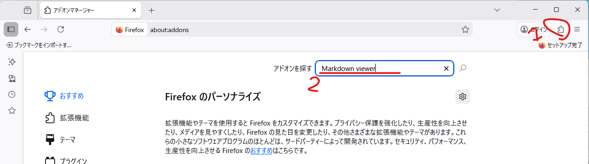
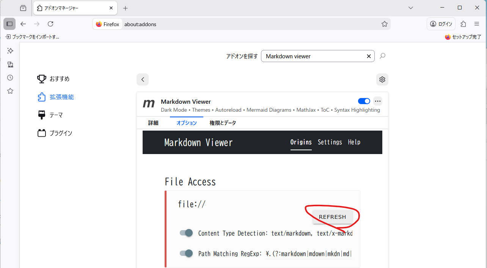

# はじめに
MarkdownBookを試用していただき、ありがとうございます。本ドキュメントでは、
* MarkdownBookのセットアップ方法
* 使用する想定ケース

について記述します。

# セットアップ方法
* 必要に応じて、Firefox, Visual studio Code をインストールします。
* Firefoxにマークダウン読み取りの拡張機能がインストールされていない場合は、拡張機能->拡張機能の管理->アドオンを探す からMarkdown Viewer を探してインストールします。

続けて、Markdown Viewer の設定、File Access の項目の Reflesh を押して権限を付与します。

* リポジトリ内のReleaseフォルダ内、最新のアーカイブを展開します。
* 展開されたファイルのうち、Script\Win\Firefox.ini, Script\Win\VisualStudioCode.ini のうち、Exe以下をFirefoxの実行ファイル、Visual Studio Codeの実行ファイルのパスに書き換えます。
* 必要に応じて、MarkDownBookLauncher.exe のショートカットを作成します。

# 使用方法
## ブックを開く
MarkDownBookLauncher.exe にリポジトリの Doc/SampleProject.mdx をドラッグ&ドロップし、開いたメニューのFirefoxボタンを押下してください。Firefox で関連ファイルがすべて開きます。同様に、Visual studio Code で編集することもできます。編集の際にはCtrl+K->Vキーでプレビューを開くと便利です。

## ブックの作成
MarkDownBookLauncher.exe を開き、...ボタンから作成フォルダを指定、作成プロジェクト名称の指定を行います。
その後、推奨パスに戻すボタンを押し、作成を押すことでブックのファイル、並びにコンテンツ作成想定パスにコンテンツが作成されます。
作成したプロジェクトファイルを MarkDownBookLauncher.exe にドラッグ&ドロップすることで開くことができます。

# 設計思想
* 要件が複雑化している昨今の開発において、変更は避けられないものであり、ドキュメントをバージョン管理することにより変更に強くする。
* 表、文書が混在している際にレイアウトが崩れやすいことに対処する。
* Markdownの簡潔な構文、ならびにスタイルシートの導入などにより、文章装飾の手間を削減する。
* Markdownで出力される文章がWordやLatexに近いため、関連文書を一覧できるよう複数ドキュメント、並びに関連ファイルを一括で扱えるようにした。また、_mkbook/以下に関連コンテンツを作成することにより、他サブフォルダと混在しにくいようにした。

# 想定使用ケース
* 仕様、設計のドキュメントを記載する際に使用する。
* 簡単なチェックリストは従来通りExcelを利用する。
* 不具合管理などは少なくともRedmineが望ましい。(やり取りに強い)
* タスク管理は不具合管理と別のポリシーのRedmine等が望ましいと考える。
* テストケース管理はAzure等を使用する。(やり取りに強い、残件の参照がしやすい)

# 今後の拡張予定
* プロジェクトファイルと関連ファイルを一括で移動するユーティリティ機能の作成
* Excelで作成した表を移行できるVBAの作成
* pdfエクスポート機能
* 開く際に任意のツールを指定できるような機能
